# 🛡️ Document Analysis AI – Comprehensive Technical Documentation

**An Enterprise-Grade Insurance Document Processing, Semantic Modeling, and AI Preparation Pipeline**

---

## 📌 Executive Overview & Problem Statement

Insurance contracts, policy wordings, endorsements, and claim forms are notoriously complex unstructured documents. They feature multi-column layouts, nested clauses, cross-referenced definitions, non-standardized terminology, and embedded font encodings. Processing these documents manually creates significant operational bottlenecks for brokers, underwriters, and claims adjusters.

This project delivers an end-to-end Python pipeline that transforms unstructured insurance PDFs into clean, structured, and validated datasets. The resulting platform prepares insurance domain data for integration with enterprise cloud and AI ecosystems:
- **Amazon Textract**: Multimodal layout analysis, key-value extraction, and form field identification.
- **Amazon Bedrock / LLMs**: Retrieval-Augmented Generation (RAG), executive policy summarization, underwriting gap analysis, and automated broker advisory.
- **OpenSearch**: Dense vector semantic search, hybrid keyword retrieval, and faceted document filtering.
- **Policy Comparison & Rules Engines**: Multi-policy side-by-side benchmarking, coverage matrix generation, and automated compliance auditing.

---

## 🏛️ System Architecture & Multi-Phase Pipeline

```mermaid
flowchart TD
    subgraph Ingestion ["1. Document Ingestion Layer"]
        PDF["Raw Insurance PDFs<br/>(Commercial Policies, Schedules, Claim Forms)"]
        Reader["PyMuPDF Reader & Clean Text Normalizer<br/>(Zero (cid:...) Font Corruption Engine)"]
        PDF --> Reader
    end

    subgraph Phase1 ["2. Phase 1: Foundational Extraction & Text Understanding"]
        T1["Document Properties & Confidence Scoring (dataset.csv)"]
        T2["Structural Heading & Section Extractor (sections.json)"]
        T3["Insurance Ontology & Domain Dictionary (insurance_dictionary.json)"]
        T4["Multi-Column Clause Extraction & Fuzzy Matching (clauses.json)"]
        T5["NLP Question-Answering Dataset Generation (qa_dataset.json)"]
        Reader --> T1 & T2 & T3 & T4 & T5
    end

    subgraph Phase2 ["3. Phase 2: Structured Semantic Modeling & Entity Extraction"]
        T6["Dynamic Policy Metadata Extraction (policy_metadata.json)"]
        T7["Coverage Inclusion Matrix (coverage_dataset.json)"]
        T8["16-Point Policy Comparison Engine (policy_comparison.json)"]
        T9["6-Category Clause Classifier (classified_clauses.json)"]
        T10["Insurance Named Entity Recognition - NER (entities.json)"]
        T11["Heading-Aware Semantic Chunker for RAG (document_chunks.json)"]
        T12["Synthetic AI Evaluation Benchmark (evaluation_dataset.json)"]
        T13["Executive Policy Summarizer (policy_summaries.json)"]
        T14["Canonical Terminology Mapping (term_mapping.json)"]
        T15["Data Integrity & Quality Validator (validation_report.json)"]
        Phase1 --> T6 & T7 & T8 & T9 & T10 & T11 & T12 & T13 & T14 & T15
    end

    subgraph Phase3 ["4. Phase 3: AI Search, Gap Analysis, Risk Modeling & Recommendations"]
        T16["Search Keywords Extraction (search_keywords.json)"]
        T17["Standardized Coverage Synonym Lookup (coverage_lookup.json)"]
        T18["Broker Review Checklists (policy_checklists.json)"]
        T19["Pairwise Policy Structural Differences (policy_differences.json)"]
        T20["Coverage Gap Analysis Engine (coverage_gaps.json)"]
        T21["Broker Advisory Recommendations (recommendations.json)"]
        T22["Bedrock / LLM Prompt Engineering Dataset (ai_prompts.json)"]
        T23["Insurance Peril & Risk Taxonomy (risk_dataset.json)"]
        T24["Multi-Label Document Classification Tags (document_tags.json)"]
        T25["Master Unified AI Dataset Aggregator (final_ai_dataset.json)"]
        Phase2 --> T16 & T17 & T18 & T19 & T20 & T21 & T22 & T23 & T24 & T25
    end
```



---

## 🔍 Detailed Phase-by-Phase Technical Breakdown

### **Phase 1: Foundational Text Extraction & Document Understanding**

Phase 1 establishes the text extraction layer, heading detection, domain ontology, and clause decomposition.

#### 1. Corrupted-Free PDF Text Extraction Engine (`utils/pdf_reader.py`)
- **Challenge Addressed**: Scanned PDFs and embedded subsets often lack standard ToUnicode CMap tables, causing standard extractors (e.g., pdfplumber) to output corrupted tokens like `(cid:137)` or `(cid:10)`.
- **Methodology**: Built a primary PyMuPDF (`fitz`) engine paired with `clean_extracted_text()`. It normalizes unicode character encodings, strips unprintable control codes and replacement characters (`\ufffd`, `\u200b`), unifies smart quotes and em-dashes, and regularizes spacing while preserving genuine paragraph breaks.
- **Result**: Guarantees **0 corrupted `(cid:...)` tokens** across all extracted documents.

#### 2. Document Telemetry & Confidence Scoring (`scripts/create_dataset.py` ➔ `output/dataset.csv`)
- **Methodology**: Scans document metadata, page counts, file sizes, detected policy types, and corporate entities. Computes a multi-factor confidence score (ranging from 0.0 to 1.0) evaluating text density, header clarity, and structure completeness.
- **Dataset Delivered**: A master CSV inventory tracking extraction telemetry for all active documents.

#### 3. Layout-Aware Section Parsing (`scripts/extract_sections.py` ➔ `output/sections.json`)
- **Methodology**: Utilizes regex pattern matching and structural cues to detect section headers (*Definitions, General Conditions, Exclusions, Limits of Liability, Claims Notification*). Records start and end page boundaries, character offsets, and clean extracted section body text.
- **Dataset Delivered**: Document section hierarchies for all policies and claim forms.

#### 4. Insurance Domain Dictionary (`scripts/build_dictionary.py` ➔ `output/insurance_dictionary.json`)
- **Methodology**: Compiles a 96-term domain ontology covering technical insurance and legal concepts (*Subrogation, Indemnity, Excess, Deductible, Retroactive Date, Business Interruption, Material Damage*). Includes contextual descriptions, search keywords, and an interactive query CLI tool (`scripts/search_dictionary.py`).
- **Dataset Delivered**: Comprehensive insurance dictionary and keyword lookup.

#### 5. Multi-Column Clause Extraction & Fuzzy Matching (`scripts/analyze_clauses.py` ➔ `output/clauses.json`)
- **Methodology**: Resolves multi-column line wrapping, isolates numbered and lettered policy clauses, and applies RapidFuzz Levenshtein token similarity matching to identify shared conditions and identical clauses across competing policies.
- **Dataset Delivered**: 472 cleanly extracted clauses with cross-document similarity clusters.

#### 6. NLP Question-Answering Dataset (`scripts/create_qa_dataset.py` ➔ `output/qa_dataset.json`)
- **Methodology**: Leverages spaCy NLP sentence segmentation and dependency parsing to filter out non-sentential form fields and extract operative contractual sentences (Definitions, Exclusions, Conditions, Notification rules). Converts them into 89 clean, verified question-and-answer pairs with exact document citations.
- **Dataset Delivered**: 89 verified domain-specific Q&A pairs.

---

### **Phase 2: Structured Semantic Modeling & Entity Extraction**

Phase 2 transforms raw text into structured schema entities, categorized clause libraries, semantic chunks, and quality audit benchmarks without hardcoded document values.

#### 1. Dynamic Policy Metadata Extraction (`scripts/extract_metadata.py` ➔ `output/policy_metadata.json`)
- **Methodology (Zero Hardcoding)**: Dynamically extracts policy identifiers, corporate insurer entities (*Allianz Insurance plc, Allianz Ayudhya*), policyholders, effective start/end dates, currencies (GBP, THB, USD), and premium amounts directly from raw text using contextual window analysis.
- **Dataset Delivered**: Structured metadata records for all active policies.

#### 2. Commercial Coverage Inclusion Matrix (`scripts/extract_metadata.py` ➔ `output/coverage_dataset.json`)
- **Methodology**: Analyzes policy wordings against core commercial insurance perils (*Public Liability, Property Damage, Business Interruption, Cyber Insurance, Directors & Officers, Crime Cover, Employers Liability*). Generates boolean inclusion flags and indemnity limits.
- **Dataset Delivered**: Complete coverage inclusion profiles for each policy.

#### 3. Dynamic Policy Comparison Engine (`scripts/compare_policies.py` ➔ `output/policy_comparison.json`)
- **Methodology**: Compares two policies side-by-side across 16 critical dimensions (policy structure, insurer entity, territorial limits, indemnity caps, deductible levels, war/terrorism exclusions, dispute resolution jurisdictions).
- **Dataset Delivered**: 16-point tabular policy comparison matrix.

#### 4. 6-Category Clause Classification (`scripts/classify_clauses.py` ➔ `output/classified_clauses.json`)
- **Methodology**: Classifies 1,127 clauses into six core insurance categories:
  - `Coverage`: Affirmative grants of protection.
  - `Exclusion`: Explicit peril carve-outs and non-covered events.
  - `Definition`: Meaning of specialized terms.
  - `Condition`: Insured duties, notice obligations, and cancellation rights.
  - `Extension`: Optional add-on coverage riders.
  - `Limitation`: Inner sub-limits, aggregate caps, and deductible thresholds.
- **Dataset Delivered**: 1,127 categorized clauses with confidence metrics.

#### 5. Named Entity Recognition - NER (`scripts/extract_entities.py` ➔ `output/entities.json`)
- **Methodology**: Extracts 171 domain entities spanning Insurers, Regulators (*FCA, OIC Thailand*), Monetary Limits, Policyholders, Underwriting Divisions, Contact Channels, and Addresses with source sentence contexts.
- **Dataset Delivered**: 171 contextual named entities.

#### 6. Semantic Document Chunking for RAG (`scripts/chunk_documents.py` ➔ `output/document_chunks.json`)
- **Methodology**: Generates 777 heading-aware, sentence-preserved text chunks (~500–1000 characters with 100-character overlap) annotated with document name, page number, and section heading. Optimized for vector embeddings in OpenSearch and Bedrock Knowledge Bases.
- **Dataset Delivered**: 777 semantic chunks ready for vector indexing.

#### 7. Synthetic AI Evaluation Benchmark (`output/evaluation_dataset.json`)
- **Methodology**: Curates 16 complex evaluation questions testing multi-hop policy reasoning, exclusion conditions, and deductible rules with exact ground-truth answers and citations.
- **Dataset Delivered**: AI test benchmark for measuring RAG retrieval accuracy.

#### 8. Canonical Terminology Mapping (`output/term_mapping.json`)
- **Methodology**: Maps 20 canonical concepts to industry phrasing variations (*"Insured" ➔ "Policyholder", "Proposer", "First Named Insured"*).
- **Dataset Delivered**: Canonical ontology dictionary.

#### 9. Automated Data Quality Audit (`scripts/validate_documents.py` ➔ `output/validation_report.json`)
- **Methodology**: Audits extracted data for completeness, mandatory field presence, date validity, and coverage integrity.
- **Dataset Delivered**: Data quality validation report confirming a **100% audit pass score**.

---

### **Phase 3: AI Search, Gap Analysis, Risk Modeling & Recommendations**

Phase 3 builds the analytical layer that powers semantic search, automated underwriting advisory, risk management, and Bedrock prompt orchestration.

#### 1. Search Keywords Dataset (`scripts/generate_keywords.py` ➔ `output/search_keywords.json`)
- **Methodology**: Dynamically extracts high-relevance domain search keywords (*Public Liability, Property Damage, Business Interruption, Cyber, Fire, Theft, Flood, Retail, Commercial, D&O, Claim Notification*) for each document to support sparse/BM25 and OpenSearch keyword indexing.
- **Dataset Delivered**: Document-level keyword datasets for all policies and claim forms.

#### 2. Coverage Synonym Lookup (`scripts/build_phase3_datasets.py` ➔ `output/coverage_lookup.json`)
- **Methodology**: Establishes a standardized lookup table linking 29 commercial coverage variations to canonical terms (e.g., *"General Liability" -> "Public Liability"*, *"Loss of Profits" -> "Business Interruption"*, *"D&O Cover" -> "Management Liability"*, *"Fidelity Guarantee" -> "Crime Cover"*).
- **Dataset Delivered**: 29 standardized coverage synonym mappings.

#### 3. Broker Policy Review Checklists (`scripts/build_phase3_datasets.py` ➔ `output/policy_checklists.json`)
- **Methodology**: Formulates comprehensive broker review checklists categorized by policy line:
  - *Commercial Policy Checklist*: Policy number, period, trading address, Public Liability limit, Property replacement value, Business Interruption period, deductibles, premium.
  - *Management Liability Checklist*: D&O limit, Corporate Liability, EPL limit, Statutory Liability, Crime cover, defense cost advancement, retroactive date.
  - *Property & Casualty Checklist*: Sum insured, public/products liability, specific perils, subrogation rights, cancellation terms.
  - *Claim Review Checklist*: Incident date/time, damage estimate, third-party involvement, police report references, supporting documentation.
- **Dataset Delivered**: 4 comprehensive broker review checklists.

#### 4. Pairwise Policy Structural Differences (`scripts/build_phase3_datasets.py` ➔ `output/policy_differences.json`)
- **Methodology**: Computes pairwise structural differences between policy wordings, highlighting variances in insurer entity, coverage sections, sub-limits, territorial scopes, and dispute resolution venues.
- **Dataset Delivered**: Multi-pair structural difference datasets.

#### 5. Coverage Gap Analysis Engine (`scripts/build_phase3_datasets.py` ➔ `output/coverage_gaps.json`)
- **Methodology**: Evaluates each active policy profile against comprehensive commercial risk benchmarks to identify missing protections (e.g., lack of standalone Cyber Insurance, missing Flood cover, or absence of D&O extensions).
- **Dataset Delivered**: Coverage gap audit records for all active policies.

#### 6. Broker Advisory Recommendations (`scripts/build_phase3_datasets.py` ➔ `output/recommendations.json`)
- **Methodology**: Synthesizes coverage gaps and policy profiles to generate tailored, actionable advisory recommendations (e.g., extending Business Interruption indemnity periods to 24 months, increasing Public Liability limits, or adding Cyber Extortion endorsements).
- **Dataset Delivered**: Advisory recommendation profiles per policy.

#### 7. AI Prompt Engineering Dataset (`scripts/build_phase3_datasets.py` ➔ `output/ai_prompts.json`)
- **Methodology**: Formulates 8 standardized prompt templates for Bedrock LLM task orchestration:
  - *Policy Summary*: Key coverages, exclusions, and critical dates.
  - *Policy Comparison*: Tabular side-by-side limit, deductible, and territorial comparison.
  - *Coverage Extraction*: Active sections, sub-limits, and indemnity schedules.
  - *Clause Analysis*: Classification into Coverage, Exclusion, Condition, Definition, Extension, Limitation.
  - *Risk Analysis*: Operational, casualty, property, and cyber risk assessment.
  - *Gap Analysis*: Benchmarking missing covers against enterprise profiles.
  - *Broker Recommendation*: Formulating actionable client advisory points.
  - *Claim Form Extraction*: Incident date, loss description, claimant details, and estimated damages.
- **Dataset Delivered**: 8 reusable Bedrock prompt templates.

#### 8. Insurance Risk Taxonomy & Peril Mapping (`scripts/build_phase3_datasets.py` ➔ `output/risk_dataset.json`)
- **Methodology**: Catalogs major commercial risks (*Cyber Attack, Fire, Theft, Flood, Equipment Breakdown, Storm Damage, Third-Party Bodily Injury, Management Misconduct*) with category classifications, peril descriptions, and related required coverages.
- **Dataset Delivered**: 8 structured risk-to-coverage mappings.

#### 9. Multi-Label Document Tagging (`scripts/build_phase3_datasets.py` ➔ `output/document_tags.json`)
- **Methodology**: Dynamically assigns multi-label classification tags (*Commercial, Retail, Management Liability, Claim Form, Casualty, Allianz*) to every document for faceted search filtering.
- **Dataset Delivered**: Tagging profiles for all 7 documents.

#### 10. Master Unified AI Dataset (`scripts/build_final_dataset.py` ➔ `output/final_ai_dataset.json`)
- **Methodology**: Integrates outputs from all three phases into a single master JSON dataset. Each document profile aggregates metadata, tags, search keywords, executive summary, coverages, coverage gaps, broker recommendations, associated perils, section counts, clause counts, sample clauses, and verified Q&A pairs.
- **Dataset Delivered**: Master AI platform dataset ready for OpenSearch and Amazon Bedrock ingestion.

---

## 📂 Complete Master Dataset Catalog

| # | Dataset File | Phase | Records / Items | Primary Function |
|---|---|:---:|---|---|
| 1 | `dataset.csv` | Phase 1 | 7 documents | Document inventory, page counts, confidence scores |
| 2 | `sections.json` | Phase 1 | 7 documents | Structural headings, page spans, character offsets |
| 3 | `insurance_dictionary.json` | Phase 1 | 96 terms | Domain terms, definitions, and search keywords |
| 4 | `clauses.json` | Phase 1 | 472 clauses | Extracted policy clauses with fuzzy similarity clusters |
| 5 | `qa_dataset.json` | Phase 1 | 89 QA pairs | Clean, verified insurance Q&A training pairs |
| 6 | `policy_metadata.json` | Phase 2 | 4 policies | Insurer, policyholder, dates, currency, premium |
| 7 | `coverage_dataset.json` | Phase 2 | 4 policies | Peril inclusion/exclusion matrix and indemnity limits |
| 8 | `policy_comparison.json` | Phase 2 | 16 fields | Side-by-side comparative policy analysis |
| 9 | `classified_clauses.json` | Phase 2 | 1,127 clauses | 6-category classified clause library |
| 10 | `entities.json` | Phase 2 | 171 entities | Named entities (limits, dates, regulators, helplines) |
| 11 | `document_chunks.json` | Phase 2 | 777 chunks | Heading-aware semantic chunks for OpenSearch / RAG |
| 12 | `evaluation_dataset.json` | Phase 2 | 16 questions | Ground-truth AI evaluation benchmark |
| 13 | `policy_summaries.json` | Phase 2 | 5 summaries | Executive policy summaries |
| 14 | `term_mapping.json` | Phase 2 | 20 concepts | Canonical ontology & synonym mappings |
| 15 | `validation_report.json` | Phase 2 | 4 audit reports | Quality audit report (100% pass score) |
| 16 | `search_keywords.json` | Phase 3 | 7 documents | High-relevance search keywords per document |
| 17 | `coverage_lookup.json` | Phase 3 | 29 mappings | Canonical coverage synonym lookup table |
| 18 | `policy_checklists.json` | Phase 3 | 4 checklists | Broker policy review checklists by business line |
| 19 | `policy_differences.json` | Phase 3 | 3 comparisons | Pairwise policy structural differences |
| 20 | `coverage_gaps.json` | Phase 3 | 4 policies | Missing coverage gap analysis |
| 21 | `recommendations.json` | Phase 3 | 4 policies | Actionable broker advisory recommendations |
| 22 | `ai_prompts.json` | Phase 3 | 8 templates | Bedrock / LLM task prompt templates |
| 23 | `risk_dataset.json` | Phase 3 | 8 risks | Insurance peril taxonomy mapped to covers |
| 24 | `document_tags.json` | Phase 3 | 7 documents | Multi-label document classification tags |
| 25 | `final_ai_dataset.json` | Phase 3 | 7 master profiles | Unified, aggregated master AI dataset |

---

## 🧪 Comprehensive Verification & Test Suite

The pipeline includes an automated test harness [`scripts/verify_tasks.py`](file:///c:/Users/anshi/Downloads/analysis-ai-round2/analysis-ai/scripts/verify_tasks.py) executing all pipeline scripts and validating **all 25 tasks end-to-end**:

```bash
# Run the complete test suite
python scripts/verify_tasks.py
```

### **Verification Results (83/83 Checks Passed - 100% Pass Rate)**
```text
===========================================================================
DOCUMENT ANALYSIS AI - COMPREHENSIVE VERIFICATION REPORT
===========================================================================
Task 1  - Dataset Creation (Metadata Extraction)       --> 4/4 checks passed
Task 2  - Section Extraction                           --> 3/3 checks passed
Task 3  - Insurance Dictionary (96 terms)              --> 3/3 checks passed
Task 4  - Clause Analysis (472 clauses)                --> 3/3 checks passed
Task 5  - Q&A Dataset (89 verified QA pairs)           --> 4/4 checks passed
Task 6  - Extract Policy Information (4 policies)      --> 4/4 checks passed
Task 7  - Create Coverage Dataset                      --> 3/3 checks passed
Task 8  - Compare Two Insurance Policies (16 fields)   --> 3/3 checks passed
Task 9  - Classify Insurance Clauses (1,127 clauses)   --> 4/4 checks passed
Task 10 - Extract Entities (171 entities)              --> 4/4 checks passed
Task 11 - Document Chunking (777 semantic chunks)      --> 4/4 checks passed
Task 12 - Create AI Test Questions (16 questions)      --> 3/3 checks passed
Task 13 - Create Policy Summary (5 summaries)          --> 3/3 checks passed
Task 14 - Standardise Insurance Terms (20 mappings)    --> 3/3 checks passed
Task 15 - Validate Insurance Documents (100% score)    --> 3/3 checks passed
Task 16 - Create Search Keywords Dataset (7 docs)      --> 4/4 checks passed
Task 17 - Build Coverage Lookup Dataset (29 mappings)  --> 3/3 checks passed
Task 18 - Build Policy Checklist Dataset (4 checklists)--> 3/3 checks passed
Task 19 - Create Policy Difference Dataset (3 pairs)   --> 3/3 checks passed
Task 20 - Create Coverage Gap Dataset (4 policies)     --> 3/3 checks passed
Task 21 - Create Broker Recommendations (4 policies)   --> 3/3 checks passed
Task 22 - Create AI Prompt Dataset (8 prompt templates)--> 3/3 checks passed
Task 23 - Create Insurance Risk Dataset (8 perils)     --> 3/3 checks passed
Task 24 - Create Document Tags (7 documents)           --> 3/3 checks passed
Task 25 - Generate Final AI Dataset (7 master profiles)--> 4/4 checks passed
===========================================================================
OVERALL: 83/83 checks passed (100% Pass Rate)
===========================================================================
```

---

## 📦 Project Directory Layout

```text
analysis-ai/
├── README.md                      # Comprehensive project technical documentation
├── requirements.txt               # Dependencies (pymupdf, pdfplumber, rapidfuzz, spacy, pandas)
├── .gitignore                     # Git configuration ignoring temp files, logs, and environments
│
├── config/                        # Configuration loader and patterns
│   ├── settings.py                # Paths and directory configurations
│   ├── headings.json              # Section heading ontology
│   ├── patterns.py                # Regex extraction patterns
│   └── synonyms.py                # Term mapping definitions
│
├── dataset/                       # Raw Source Documents
│   ├── policy/                    # Commercial policy PDFs (policy1.pdf - policy4.pdf)
│   └── claim/                     # Proposal & claim form PDFs (claim.pdf - claim2.pdf)
│
├── utils/                         # Reusable Engineering Modules
│   ├── pdf_reader.py              # PyMuPDF clean extractor & (cid:) sanitizer
│   ├── logger.py                  # Standardized project logger
│   ├── json_utils.py              # Safe JSON file reader/writer
│   ├── section_extractor.py       # Heading detection & span parser
│   └── clause_extractor.py        # Multi-column line unwrapper & clause parser
│
├── scripts/                       # 25 Task Pipeline Scripts
│   ├── README.md                  # Script-level execution guide
│   ├── create_dataset.py          # Task 1: Dataset creation & metadata extraction
│   ├── extract_sections.py        # Task 2: Document section parsing
│   ├── build_dictionary.py        # Task 3: Insurance dictionary builder
│   ├── search_dictionary.py       # Task 3: Interactive dictionary search CLI
│   ├── analyze_clauses.py         # Task 4: Clause extraction & fuzzy similarity
│   ├── create_qa_dataset.py       # Task 5: NLP-driven verified Q&A generator
│   ├── extract_metadata.py        # Tasks 6 & 7: Dynamic policy metadata & coverages
│   ├── compare_policies.py        # Task 8: Dynamic policy comparison engine
│   ├── classify_clauses.py        # Task 9: 6-category clause classifier
│   ├── extract_entities.py        # Task 10: Named Entity Recognition (NER)
│   ├── chunk_documents.py         # Task 11: Semantic document chunker for RAG
│   ├── validate_documents.py      # Task 15: Automated quality audit validator
│   ├── generate_keywords.py       # Task 16: Search keywords generator
│   ├── build_phase3_datasets.py   # Tasks 17-24: Lookup, checklists, gaps, risks, prompts
│   ├── build_final_dataset.py     # Task 25: Master unified AI dataset builder
│   └── verify_tasks.py            # Master verification suite (Tasks 1-25)
│
└── output/                        # 25 Generated JSON/CSV Datasets (100% Clean)
```
