# 🛡️ Document Analysis AI – Comprehensive Technical Documentation

**An Enterprise-Grade Insurance Document Processing, Semantic Modeling, and AI Preparation Pipeline**

---

## 📌 Executive Overview & Problem Statement

Insurance contracts, policy wordings, endorsements, and claim forms are notoriously complex unstructured documents. They feature multi-column layouts, nested clauses, cross-referenced definitions, non-standardized terminology, and embedded font encodings. Processing these documents manually creates significant operational bottlenecks for brokers, underwriters, and claims adjusters.

This project delivers an end-to-end Python pipeline that transforms unstructured insurance PDFs into clean, structured, and validated datasets. The resulting platform prepares insurance domain data for integration with enterprise cloud and AI ecosystems:
- **Amazon Textract**: Multimodal layout analysis, key-value extraction, and form field identification.
- **Amazon Bedrock / LLMs**: Retrieval-Augmented Generation (RAG), executive policy summarization, underwriting gap analysis, and automated broker advisory.
- **OpenSearch**: Dense vector semantic search, hybrid keyword retrieval, and faceted document filtering.
- **Policy Comparison & Rules Engines**: Multi-policy side-by-side benchmarking, coverage matrix generation, and automated compliance auditing.

---

## 🏛️ System Architecture & Multi-Phase Pipeline

```mermaid
flowchart TD
    subgraph Ingestion ["1. Document Ingestion Layer"]
        PDF["Raw Insurance PDFs<br/>(Commercial Policies, Schedules, Claim Forms)"]
        Reader["PyMuPDF Reader & Clean Text Normalizer<br/>(Zero (cid:...) Font Corruption Engine)"]
        PDF --> Reader
    end

    subgraph Phase1 ["2. Phase 1: Foundational Extraction & Text Understanding"]
        T1["Document Properties & Confidence Scoring (dataset.csv)"]
        T2["Structural Heading & Section Extractor (sections.json)"]
        T3["Insurance Ontology & Domain Dictionary (insurance_dictionary.json)"]
        T4["Multi-Column Clause Extraction & Fuzzy Matching (clauses.json)"]
        T5["NLP Question-Answering Dataset Generation (qa_dataset.json)"]
        Reader --> T1 & T2 & T3 & T4 & T5
    end

    subgraph Phase2 ["3. Phase 2: Structured Semantic Modeling & Entity Extraction"]
        T6["Dynamic Policy Metadata Extraction (policy_metadata.json)"]
        T7["Coverage Inclusion Matrix (coverage_dataset.json)"]
        T8["16-Point Policy Comparison Engine (policy_comparison.json)"]
        T9["6-Category Clause Classifier (classified_clauses.json)"]
        T10["Insurance Named Entity Recognition - NER (entities.json)"]
        T11["Heading-Aware Semantic Chunker for RAG (document_chunks.json)"]
        T12["Synthetic AI Evaluation Benchmark (evaluation_dataset.json)"]
        T13["Executive Policy Summarizer (policy_summaries.json)"]
        T14["Canonical Terminology Mapping (term_mapping.json)"]
        T15["Data Integrity & Quality Validator (validation_report.json)"]
        Phase1 --> T6 & T7 & T8 & T9 & T10 & T11 & T12 & T13 & T14 & T15
    end

    subgraph Phase3 ["4. Phase 3: AI Search, Gap Analysis, Risk Modeling & Recommendations"]
        T16["Search Keywords Extraction (search_keywords.json)"]
        T17["Standardized Coverage Synonym Lookup (coverage_lookup.json)"]
        T18["Broker Review Checklists (policy_checklists.json)"]
        T19["Pairwise Policy Structural Differences (policy_differences.json)"]
        T20["Coverage Gap Analysis Engine (coverage_gaps.json)"]
        T21["Broker Advisory Recommendations (recommendations.json)"]
        T22["Bedrock / LLM Prompt Engineering Dataset (ai_prompts.json)"]
        T23["Insurance Peril & Risk Taxonomy (risk_dataset.json)"]
        T24["Multi-Label Document Classification Tags (document_tags.json)"]
        T25["Master Unified AI Dataset Aggregator (final_ai_dataset.json)"]
        Phase2 --> T16 & T17 & T18 & T19 & T20 & T21 & T22 & T23 & T24 & T25
    end

    subgraph Phase4 ["5. Phase 4: Data Quality, Testing & AI Pipeline Preparation"]
        T26["JSON Integrity Validator (json_validation_report.json)"]
        T27["Duplicate Insurance Info Finder (duplicate_report.json)"]
        T28["Search Test Benchmark Dataset (search_test_dataset.json)"]
        T29["AI Response Evaluation Dataset (ai_evaluation.json)"]
        T30["Business Rules Engine Dataset (rules_dataset.json)"]
        T31["Unified Insurance Knowledge Base (insurance_knowledge_base.json)"]
        T32["End-to-End AI Test Scenarios (ai_test_scenarios.json)"]
        T33["Project Telemetry & Statistics (dataset_statistics.json)"]
        T34["Executive Final Project Report (project_report.md)"]
        Phase3 --> T26 & T27 & T28 & T29 & T30 & T31 & T32 & T33 & T34
    end
```

---

## 🔍 Detailed Phase-by-Phase Technical Breakdown

### **Phase 1: Foundational Text Extraction & Document Understanding**

Phase 1 establishes the text extraction layer, heading detection, domain ontology, and clause decomposition.

#### 1. Corrupted-Free PDF Text Extraction Engine (`utils/pdf_reader.py`)
- **Challenge Addressed**: Scanned PDFs and embedded subsets often lack standard ToUnicode CMap tables, causing standard extractors (e.g., pdfplumber) to output corrupted tokens like `(cid:137)` or `(cid:10)`.
- **Methodology**: Built a primary PyMuPDF (`fitz`) engine paired with `clean_extracted_text()`. It normalizes unicode character encodings, strips unprintable control codes and replacement characters (`\ufffd`, `\u200b`), unifies smart quotes and em-dashes, and regularizes spacing while preserving genuine paragraph breaks.
- **Result**: Guarantees **0 corrupted `(cid:...)` tokens** across all extracted documents.

#### 2. Document Telemetry & Confidence Scoring (`scripts/create_dataset.py` ➔ `output/dataset.csv`)
- **Methodology**: Scans document metadata, page counts, file sizes, detected policy types, and corporate entities. Computes a multi-factor confidence score (ranging from 0.0 to 1.0) evaluating text density, header clarity, and structure completeness.
- **Dataset Delivered**: A master CSV inventory tracking extraction telemetry for all active documents.

#### 3. Layout-Aware Section Parsing (`scripts/extract_sections.py` ➔ `output/sections.json`)
- **Methodology**: Utilizes regex pattern matching and structural cues to detect section headers (*Definitions, General Conditions, Exclusions, Limits of Liability, Claims Notification*). Records start and end page boundaries, character offsets, and clean extracted section body text.
- **Dataset Delivered**: Document section hierarchies for all policies and claim forms.

#### 4. Insurance Domain Dictionary (`scripts/build_dictionary.py` ➔ `output/insurance_dictionary.json`)
- **Methodology**: Compiles a 96-term domain ontology covering technical insurance and legal concepts (*Subrogation, Indemnity, Excess, Deductible, Retroactive Date, Business Interruption, Material Damage*). Includes contextual descriptions, search keywords, and an interactive query CLI tool (`scripts/search_dictionary.py`).
- **Dataset Delivered**: Comprehensive insurance dictionary and keyword lookup.

#### 5. Multi-Column Clause Extraction & Fuzzy Matching (`scripts/analyze_clauses.py` ➔ `output/clauses.json`)
- **Methodology**: Resolves multi-column line wrapping, isolates numbered and lettered policy clauses, and applies RapidFuzz Levenshtein token similarity matching to identify shared conditions and identical clauses across competing policies.
- **Dataset Delivered**: 472 cleanly extracted clauses with cross-document similarity clusters.

#### 6. NLP Question-Answering Dataset (`scripts/create_qa_dataset.py` ➔ `output/qa_dataset.json`)
- **Methodology**: Leverages spaCy NLP sentence segmentation and dependency parsing to filter out non-sentential form fields and extract operative contractual sentences (Definitions, Exclusions, Conditions, Notification rules). Converts them into 89 clean, verified question-and-answer pairs with exact document citations.
- **Dataset Delivered**: 89 verified domain-specific Q&A pairs.

---

### **Phase 2: Structured Semantic Modeling & Entity Extraction**

Phase 2 transforms raw text into structured schema entities, categorized clause libraries, semantic chunks, and quality audit benchmarks without hardcoded document values.

#### 1. Dynamic Policy Metadata Extraction (`scripts/extract_metadata.py` ➔ `output/policy_metadata.json`)
- **Methodology (Zero Hardcoding)**: Dynamically extracts policy identifiers, corporate insurer entities (*Allianz Insurance plc, Allianz Ayudhya*), policyholders, effective start/end dates, currencies (GBP, THB, USD), and premium amounts directly from raw text using contextual window analysis.
- **Dataset Delivered**: Structured metadata records for all active policies.

#### 2. Commercial Coverage Inclusion Matrix (`scripts/extract_metadata.py` ➔ `output/coverage_dataset.json`)
- **Methodology**: Analyzes policy wordings against core commercial insurance perils (*Public Liability, Property Damage, Business Interruption, Cyber Insurance, Directors & Officers, Crime Cover, Employers Liability*). Generates boolean inclusion flags and indemnity limits.
- **Dataset Delivered**: Complete coverage inclusion profiles for each policy.

#### 3. Dynamic Policy Comparison Engine (`scripts/compare_policies.py` ➔ `output/policy_comparison.json`)
- **Methodology**: Compares two policies side-by-side across 16 critical dimensions (policy structure, insurer entity, territorial limits, indemnity caps, deductible levels, war/terrorism exclusions, dispute resolution jurisdictions).
- **Dataset Delivered**: 16-point tabular policy comparison matrix.

#### 4. 6-Category Clause Classification (`scripts/classify_clauses.py` ➔ `output/classified_clauses.json`)
- **Methodology**: Classifies 1,127 clauses into six core insurance categories:
  - `Coverage`: Affirmative grants of protection.
  - `Exclusion`: Explicit peril carve-outs and non-covered events.
  - `Definition`: Meaning of specialized terms.
  - `Condition`: Insured duties, notice obligations, and cancellation rights.
  - `Extension`: Optional add-on coverage riders.
  - `Limitation`: Inner sub-limits, aggregate caps, and deductible thresholds.
- **Dataset Delivered**: 1,127 categorized clauses with confidence metrics.

#### 5. Named Entity Recognition - NER (`scripts/extract_entities.py` ➔ `output/entities.json`)
- **Methodology**: Extracts 171 domain entities spanning Insurers, Regulators (*FCA, OIC Thailand*), Monetary Limits, Policyholders, Underwriting Divisions, Contact Channels, and Addresses with source sentence contexts.
- **Dataset Delivered**: 171 contextual named entities.

#### 6. Semantic Document Chunking for RAG (`scripts/chunk_documents.py` ➔ `output/document_chunks.json`)
- **Methodology**: Generates 777 heading-aware, sentence-preserved text chunks (~500–1000 characters with 100-character overlap) annotated with document name, page number, and section heading. Optimized for vector embeddings in OpenSearch and Bedrock Knowledge Bases.
- **Dataset Delivered**: 777 semantic chunks ready for vector indexing.

#### 7. Synthetic AI Evaluation Benchmark (`output/evaluation_dataset.json`)
- **Methodology**: Curates 16 complex evaluation questions testing multi-hop policy reasoning, exclusion conditions, and deductible rules with exact ground-truth answers and citations.
- **Dataset Delivered**: AI test benchmark for measuring RAG retrieval accuracy.

#### 8. Canonical Terminology Mapping (`output/term_mapping.json`)
- **Methodology**: Maps 20 canonical concepts to industry phrasing variations (*"Insured" ➔ "Policyholder", "Proposer", "First Named Insured"*).
- **Dataset Delivered**: Canonical ontology dictionary.

#### 9. Automated Data Quality Audit (`scripts/validate_documents.py` ➔ `output/validation_report.json`)
- **Methodology**: Audits extracted data for completeness, mandatory field presence, date validity, and coverage integrity.
- **Dataset Delivered**: Data quality validation report confirming a **100% audit pass score**.

---

### **Phase 3: AI Search, Gap Analysis, Risk Modeling & Recommendations**

Phase 3 builds the analytical layer that powers semantic search, automated underwriting advisory, risk management, and Bedrock prompt orchestration—implemented with zero document-specific hardcoding and dynamic data-driven algorithms.

#### 1. Search Keywords Dataset (`scripts/generate_keywords.py` ➔ `output/search_keywords.json`)
- **Methodology**: Dynamically extracts high-relevance domain search keywords (*Public Liability, Property Damage, Business Interruption, Cyber, Fire, Theft, Flood, Retail, Commercial, D&O, Claim Notification*) for each document by matching a master taxonomy with regex word boundaries against extracted clean text. Purely content-grounded with no artificial keyword additions.
- **Dataset Delivered**: Document-level keyword datasets for all policies and claim forms.

#### 2. Coverage Synonym Lookup (`scripts/build_phase3_datasets.py` ➔ `output/coverage_lookup.json`)
- **Methodology**: Establishes a comprehensive standardized lookup table linking 35 coverage variations across commercial, management liability, personal health, and cargo lines to canonical terms (e.g., *"General Liability" -> "Public Liability"*, *"Loss of Profits" -> "Business Interruption"*, *"D&O Cover" -> "Management Liability"*, *"Medical Expenses" -> "Personal Accident"*).
- **Dataset Delivered**: 35 standardized coverage synonym mappings.

#### 3. Broker Policy Review Checklists (`scripts/build_phase3_datasets.py` ➔ `output/policy_checklists.json`)
- **Methodology**: Formulates comprehensive broker review checklists categorized by policy line:
  - *Personal Accident & Health Checklist*: Policy number, period, insured person, accidental death/disablement limits, medical expenses aggregate, emergency assistance, exclusions (pre-existing conditions, extreme sports).
  - *Management Liability Checklist*: D&O limit, Corporate Liability, EPL limit, Statutory Liability, Crime cover, defense cost advancement, retroactive date.
  - *Marine & Transit Cargo Checklist*: Transit limits, conveyances, open cover limits, Institute Cargo Clauses (A/B/C), war/strikes perils, claims procedures.
  - *Commercial Package Policy Checklist*: Trading address, Public Liability limit, Property replacement value, Business Interruption period, deductibles, premium.
  - *Claim Review Checklist*: Incident date/time, damage estimate, third-party involvement, police report references, supporting documentation.
- **Dataset Delivered**: 5 comprehensive broker review checklists across distinct insurance domains.

#### 4. Pairwise Policy Structural Differences (`scripts/build_phase3_datasets.py` ➔ `output/policy_differences.json`)
- **Methodology (Zero Hardcoding)**: Dynamically derives pairwise differences between policy documents by comparing actual extracted metadata (insurer, policy type, currency, premium), coverage inclusions/exclusions, liability limits, and deductibles directly from structured JSON data.
- **Dataset Delivered**: Dynamic pairwise structural difference profiles.

#### 5. Coverage Gap Analysis Engine (`scripts/build_phase3_datasets.py` ➔ `output/coverage_gaps.json`)
- **Methodology (Dynamic Set Difference)**: Evaluates each active policy dynamically via Python set/list comparison against reference standards appropriate for its policy line. Accurately identifies unincluded protections (e.g., lack of Personal Accident disablement extension, missing Cyber cover, or unincluded Flood cover) without document-name hardcoding.
- **Dataset Delivered**: Coverage gap audit records for all active policies.

#### 6. Broker Advisory Recommendations (`scripts/build_phase3_datasets.py` ➔ `output/recommendations.json`)
- **Methodology (Content-Grounded Rule Engine)**: Synthesizes dynamic coverage gaps and policy profile attributes to generate tailored, actionable advisory recommendations. Ensures strict alignment with policy types—preventing contradictions (e.g., Personal Health policies never receive commercial property/retail recommendations).
- **Dataset Delivered**: Contradiction-free advisory recommendation profiles per policy.

#### 7. AI Prompt Engineering Dataset (`scripts/build_phase3_datasets.py` ➔ `output/ai_prompts.json`)
- **Methodology**: Formulates 8 standardized prompt templates for Bedrock LLM task orchestration:
  - *Policy Summary*: Key coverages, exclusions, and critical dates.
  - *Policy Comparison*: Tabular side-by-side limit, deductible, and territorial comparison.
  - *Coverage Extraction*: Active sections, sub-limits, and indemnity schedules.
  - *Clause Analysis*: Classification into Coverage, Exclusion, Condition, Definition, Extension, Limitation.
  - *Risk Analysis*: Operational, casualty, property, and cyber risk assessment.
  - *Gap Analysis*: Benchmarking missing covers against enterprise profiles.
  - *Broker Recommendation*: Formulating actionable client advisory points.
  - *Claim Form Extraction*: Incident date, loss description, claimant details, and estimated damages.
- **Dataset Delivered**: 8 reusable Bedrock prompt templates.

#### 8. Insurance Risk Taxonomy & Peril Mapping (`scripts/build_phase3_datasets.py` ➔ `output/risk_dataset.json`)
- **Methodology**: Master risk list covering 10 major perils (*Cyber Attack, Fire & Explosion, Theft & Burglary, Flood & Water Inundation, Accidental Bodily Injury, Equipment Breakdown, Storm Damage, Public Bodily Injury & Property Damage, Management Misconduct, Cargo Loss & Transit Damage*). Dynamically detects applicable perils for each document based on regex keyword scanning of extracted text.
- **Dataset Delivered**: 10 structured risk-to-coverage mappings with dynamic document detection.

#### 9. Multi-Label Document Tagging (`scripts/build_phase3_datasets.py` ➔ `output/document_tags.json`)
- **Methodology (Grounded Content Detection)**: Dynamically assigns multi-label classification tags based on actual document content, policy type, insurer entity, and document category. Prevents false positive tags (e.g. no retail or commercial tags on personal health or marine cargo policies).
- **Dataset Delivered**: Clean, content-grounded tagging profiles for all 7 documents.

#### 10. Master Unified AI Dataset (`scripts/build_final_dataset.py` ➔ `output/final_ai_dataset.json`)
- **Methodology**: Integrates outputs from all three phases into a single master JSON dataset. Each document profile aggregates validated metadata, tags, search keywords, executive summary, coverages, coverage gaps, broker recommendations, associated perils, section counts, clause counts, sample clauses, and verified Q&A pairs with zero `(cid:...)` artifacts.
- **Dataset Delivered**: Master AI platform dataset ready for OpenSearch and Amazon Bedrock ingestion.

---

### **Phase 4: Data Quality, Testing & AI Pipeline Preparation**

Phase 4 completes the data pipeline by auditing, deduplicating, benchmarking, and packaging all datasets for direct consumption by Amazon Textract, Amazon Bedrock, OpenSearch, Rules Engine, and Policy Comparison Engine.

#### 1. JSON Dataset Integrity Validator (`scripts/validate_json.py` ➔ `output/json_validation_report.json`)
- **Methodology**: Audits every JSON file inside `output/` for valid JSON syntax, missing required fields, empty or null values, duplicate entries, correct data types, and presence of corrupted `(cid:...)` font artifacts.
- **Dataset Delivered**: Comprehensive JSON audit report confirming 100% of datasets pass without errors.

#### 2. Duplicate Insurance Information Finder (`scripts/find_duplicates.py` ➔ `output/duplicate_report.json`)
- **Methodology**: Identifies shared and duplicate information across documents: identical/near-identical clauses, duplicate policy numbers, shared coverage types, and recurring broker recommendations.
- **Dataset Delivered**: 38 identified shared and duplicate items across clauses, coverages, and recommendations.

#### 3. Search Test Benchmark Dataset (`scripts/create_search_tests.py` ➔ `output/search_test_dataset.json`)
- **Methodology**: Generates 36 realistic user search queries spanning coverages, perils, financial limits, temporal periods, entities, claims procedures, and exclusions, mapped to their ground-truth expected matching documents.
- **Dataset Delivered**: 36 search queries with expected document matches.

#### 4. AI Response Evaluation Dataset (`scripts/create_ai_evaluations.py` ➔ `output/ai_evaluation.json`)
- **Methodology**: Formulates ground-truth evaluation cases across 5 core AI tasks: *Policy Summary*, *Coverage Extraction*, *Clause Explanation*, *Policy Comparison*, and *Risk Identification*.
- **Dataset Delivered**: 16 structured AI evaluation benchmark cases.

#### 5. Business Rules Engine Dataset (`scripts/create_rules.py` ➔ `output/rules_dataset.json`)
- **Methodology**: Engineers 16 reusable business decision rules for automated underwriting and advisory: coverage gaps (Cyber, Business Interruption), limit adequacy ($10M Public Liability threshold), renewals (30-day triggers), and deductible limits.
- **Dataset Delivered**: 16 structured underwriting decision rules.

#### 6. Unified Insurance Knowledge Base (`scripts/build_knowledge_base.py` ➔ `output/insurance_knowledge_base.json`)
- **Methodology**: Consolidates 96 insurance terms, 6 representative clause categories, 10 peril taxonomies, 35 coverage synonym mappings, and 16 underwriting rules into a single centralized, reusable knowledge repository.
- **Dataset Delivered**: Unified master insurance knowledge base.

#### 7. End-to-End AI Test Scenarios (`scripts/create_test_scenarios.py` ➔ `output/ai_test_scenarios.json`)
- **Methodology**: Defines 5 comprehensive real-world business scenarios: *Renewal Benchmarking & Quote Comparison*, *Automated FNOL Claims Processing*, *Broker Commercial Gap Audit*, *D&O Limit Adequacy Review*, and *Marine Cargo Transit Adjudication*.
- **Dataset Delivered**: 5 multi-step business test scenarios.

#### 8. Dataset Telemetry & Statistics (`scripts/statistics.py` ➔ `output/dataset_statistics.json`)
- **Methodology**: Programmatically compiles holistic project-wide metrics across documents (7 docs, 210 pages), policies (4), coverages (12 distinct, 35 synonyms), clauses (472 extracted, 1,127 classified), questions (157), perils (10), and rules (37).
- **Dataset Delivered**: Comprehensive dataset statistics report.

#### 9. Final Executive Project Report (`scripts/build_report.py` ➔ `output/project_report.md`)
- **Methodology**: Programmatically compiles a full executive Markdown summary of the entire 34-task project, covering architecture, metrics, phase accomplishments, and cloud integration roadmap.
- **Dataset Delivered**: Executive Markdown project report.

---

