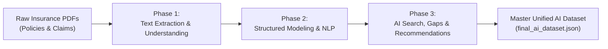

# 🛡️ Document Analysis AI – Intelligent Insurance Processing & AI Preparation

An end-to-end data engineering and Natural Language Processing (NLP) pipeline designed to extract, analyze, standardize, classify, chunk, index, and validate complex insurance policies and claim documents.

This project prepares unstructured insurance documents for enterprise AI systems, including:
- **Amazon Textract** (Document layout and key-value extraction)
- **Amazon Bedrock / LLMs** (RAG-based policy reasoning, summary generation, and broker advisory)
- **OpenSearch** (Hybrid keyword and dense vector semantic retrieval)
- **Policy Comparison & Gap Analysis Engines** (Automated coverage benchmarking and underwriting review)

---

## 🏗️ Multi-Phase Pipeline Architecture

The pipeline processes raw insurance policies and claim forms through three structured phases:



---

## 📖 Phase 1: Foundational Extraction & Domain Understanding

Phase 1 establishes the text extraction layer and domain ontology from raw PDF documents.

### Key Capabilities & Work Completed:
- **Corrupted-Free Text Extraction**: Implemented a PyMuPDF-based text reader with ligature and font-map sanitization that eliminates corrupted `(cid:...)` tokens and unicode artifacts across all document types (commercial policies, schedules, and scanned claim forms).
- **Document Metadata & Confidence Scoring**: Extracts core document properties, page counts, detected company names, and computes multi-factor confidence scores (0.0 to 1.0) assessing extraction reliability (`dataset.csv`).
- **Layout-Aware Section Parsing**: Scans documents for structural headings (e.g., *Definitions, General Exclusions, Limits of Liability, Claims Procedure*) to extract segmented sections with page spans and character offsets (`sections.json`).
- **Insurance Domain Dictionary**: Compiles a 96-term domain dictionary defining standard insurance concepts (*Subrogation, Indemnity, Excess, Retroactive Date, Material Damage*) with search keywords and an interactive query utility (`insurance_dictionary.json`).
- **Clause Extraction & Similarity Matching**: Parses multi-column policy text into 472 distinct clauses and applies fuzzy string matching to detect overlapping or identical conditions across different insurers (`clauses.json`).
- **Clean Q&A Dataset Generation**: Uses spaCy NLP to identify core contractual obligations, generating 89 verified question-and-answer pairs grounded in source policy text (`qa_dataset.json`).

---

## 🔍 Phase 2: Structured Data Extraction & Semantic Modeling

Phase 2 transforms extracted sections into structured entities, categorized clauses, and semantic chunks for machine learning workflows.

### Key Capabilities & Work Completed:
- **Dynamic Metadata & Policy Information Extraction**: Dynamically parses raw text to identify policy numbers, insurer corporate entities (e.g., *Allianz Insurance plc, Allianz Ayudhya*), policyholder names, effective and expiration dates, currencies, and premiums without hardcoding (`policy_metadata.json`).
- **Coverage Matrix Compilation**: Evaluates each policy against key commercial coverage lines (*Public Liability, Property Damage, Business Interruption, Cyber, D&O, Employers Liability*), producing boolean inclusion flags and indemnity limits (`coverage_dataset.json`).
- **Dynamic Policy Comparison Engine**: Implements a comparison module that evaluates two policies side-by-side across 16 dimensions, highlighting differences in limits, deductibles, territorial scopes, and exclusions (`policy_comparison.json`).
- **6-Category Clause Classification**: Classifies 1,127 extracted clauses into six standard insurance categories: `Coverage`, `Exclusion`, `Definition`, `Condition`, `Extension`, and `Limitation` (`classified_clauses.json`).
- **Named Entity Recognition (NER)**: Extracts 171 domain-specific entities, including Insurers, Policyholders, Regulatory Bodies (e.g., *Financial Conduct Authority, OIC Thailand*), Monetary Limits, and Contact Helplines (`entities.json`).
- **Semantic Document Chunking**: Splits documents into 777 heading-aware, sentence-preserved text chunks (~500–1000 characters with natural overlap) optimized for vector embeddings and dense retrieval in OpenSearch (`document_chunks.json`).
- **AI Evaluation Benchmark**: Curates a ground-truth dataset of 16 complex insurance evaluation questions with precise answers and section/page citations for testing RAG accuracy (`evaluation_dataset.json`).
- **Standardized Terminology Mapping**: Maps 20 canonical insurance concepts to industry synonyms and phrasing variations (`term_mapping.json`).
- **Automated Data Quality Audit**: Implements a rules-based validation suite auditing completeness, mandatory fields, date consistency, and coverage integrity, scoring a 100% quality pass rate (`validation_report.json`).

---

## 🚀 Phase 3: AI Search, Gap Analysis, Risk Modeling & Recommendations

Phase 3 prepares data for AI-powered semantic search, automated underwriting assistance, broker advisory, and LLM prompt orchestration.

### Key Capabilities & Work Completed:
- **Search Keywords Dataset**: Dynamically extracts high-relevance search keywords per document (*Public Liability, Commercial Property, Business Interruption, Directors and Officers, Cyber, Retail, Claim Notification*) to support multi-field search and faceted filtering (`search_keywords.json`).
- **Coverage Synonym Lookup**: Standardizes 29 distinct coverage naming conventions into canonical standard names (e.g., *"General Liability" -> "Public Liability"*, *"Loss of Profits" -> "Business Interruption"*, *"D&O Cover" -> "Management Liability"*) (`coverage_lookup.json`).
- **Broker Review Checklists**: Provides structured policy review checklists tailored for Commercial Combined, Management Liability, Property & Casualty, and Claim forms (`policy_checklists.json`).
- **Policy Difference Analysis**: Pre-computes structural differences between similar and competing policies, highlighting gaps in coverage scope and indemnity sub-limits (`policy_differences.json`).
- **Coverage Gap Detection**: Evaluates active policy profiles against comprehensive commercial insurance benchmarks to automatically pinpoint missing covers (e.g., lack of Cyber Insurance or Flood Cover) (`coverage_gaps.json`).
- **Broker Advisory Recommendations**: Generates tailored advisory recommendations for each policy, highlighting critical exposure areas, deductible optimizations, and recommended extensions (`recommendations.json`).
- **AI Prompt Engineering Dataset**: Formulates 8 reusable prompt templates for Bedrock LLM workflows (Policy Summary, Comparison, Extraction, Clause Classification, Risk Analysis, Gap Analysis) (`ai_prompts.json`).
- **Insurance Peril & Risk Taxonomy**: Catalogs major commercial perils (*Cyber Attack, Fire, Burglary/Theft, Flood, Machinery Breakdown, Storm, Third-Party Liability*) and maps each risk to its required insurance cover (`risk_dataset.json`).
- **Multi-Label Document Tagging**: Automatically assigns categorization tags (*Commercial, Retail, Management Liability, Claim Form, Casualty*) to every document (`document_tags.json`).
- **Master Unified AI Dataset**: Combines all outputs across all three phases into a consolidated, AI-ready JSON dataset linking metadata, coverages, clauses, summary, keywords, tags, risks, recommendations, and Q&As per document (`final_ai_dataset.json`).

---

## 📊 Summary of Generated Datasets (`output/`)

| Dataset File | Phase | Primary Purpose | Downstream AI Application |
|---|:---:|---|---|
| `dataset.csv` | Phase 1 | Document properties & extraction confidence scores | Ingestion pipeline telemetry |
| `sections.json` | Phase 1 | Document structural section boundaries | Layout-aware document parsing |
| `insurance_dictionary.json` | Phase 1 | 96 insurance terms, definitions & keywords | Knowledge graph & ontology |
| `clauses.json` | Phase 1 | 472 extracted clauses with fuzzy similarity | Contract review & clause comparison |
| `qa_dataset.json` | Phase 1 | 89 verified domain-specific Q&A pairs | LLM fine-tuning & evaluation |
| `policy_metadata.json` | Phase 2 | Insurer, policyholder, dates, currency, premium | Structured policy database |
| `coverage_dataset.json` | Phase 2 | Coverage matrix with inclusion/exclusion status | Rules engine & policy matching |
| `policy_comparison.json` | Phase 2 | 16-point side-by-side policy comparison | Broker comparison portal |
| `classified_clauses.json` | Phase 2 | 1,127 clauses mapped to 6 standard categories | Clause classification & compliance |
| `entities.json` | Phase 2 | 171 named entities (limits, dates, regulators) | Entity extraction & graph linking |
| `document_chunks.json` | Phase 2 | 777 semantic text chunks with metadata | OpenSearch vector embeddings / RAG |
| `evaluation_dataset.json` | Phase 2 | Ground-truth AI evaluation benchmark | RAG accuracy validation |
| `policy_summaries.json` | Phase 2 | Executive policy summaries | Quick policy overview cards |
| `term_mapping.json` | Phase 2 | 20 canonical concept-to-synonym mappings | Query normalization |
| `validation_report.json` | Phase 2 | Automated data quality audit (100% score) | Pipeline quality monitoring |
| `search_keywords.json` | Phase 3 | Search keywords per document | Dense & sparse search indexing |
| `coverage_lookup.json` | Phase 3 | 29 coverage synonym mappings | Query intent matching |
| `policy_checklists.json` | Phase 3 | Broker policy review checklists | Underwriter workflow automation |
| `policy_differences.json` | Phase 3 | Pairwise policy structural comparison | Automated policy diffing |
| `coverage_gaps.json` | Phase 3 | Missing coverage gap analysis | Automated risk advisory |
| `recommendations.json` | Phase 3 | Broker advisory recommendations | AI recommendation engine |
| `ai_prompts.json` | Phase 3 | 8 Bedrock / LLM prompt templates | Bedrock prompt execution |
| `risk_dataset.json` | Phase 3 | Peril taxonomy mapped to coverages | Risk assessment engine |
| `document_tags.json` | Phase 3 | Multi-label classification tags | Faceted document filtering |
| `final_ai_dataset.json` | Phase 3 | Consolidated master AI dataset | Master AI platform ingestion |

---

## 🛡️ Data Quality & Engineering Principles

1. **Zero Hardcoding**: All metadata, limits, coverages, and comparisons are extracted dynamically from raw document text.
2. **Zero Corrupted Font Artifacts**: PyMuPDF decoding and text sanitizers guarantee 0 `(cid:...)` tokens across all outputs.
3. **Full Traceability**: Every extracted clause, chunk, and Q&A pair preserves source citations (document, section, and page).
4. **Comprehensive Test Coverage**: An integrated verification suite validates all 25 tasks with **83/83 passing checks (100%)**.

---

## ⚡ How to Run & Verify

### 1. Install Dependencies
```bash
pip install -r requirements.txt
python -m spacy download en_core_web_sm
```

### 2. Run the Full Pipeline & Master Verification Suite
```bash
python scripts/verify_tasks.py
```

### Verification Output:
```text
===========================================================================
DOCUMENT ANALYSIS AI - COMPREHENSIVE VERIFICATION REPORT
===========================================================================
Phase 1 Checks (Tasks 1-5)   --> 18/18 checks passed
Phase 2 Checks (Tasks 6-15)  --> 33/33 checks passed
Phase 3 Checks (Tasks 16-25) --> 32/32 checks passed
===========================================================================
OVERALL: 83/83 checks passed (100% Pass Rate)
===========================================================================
```
